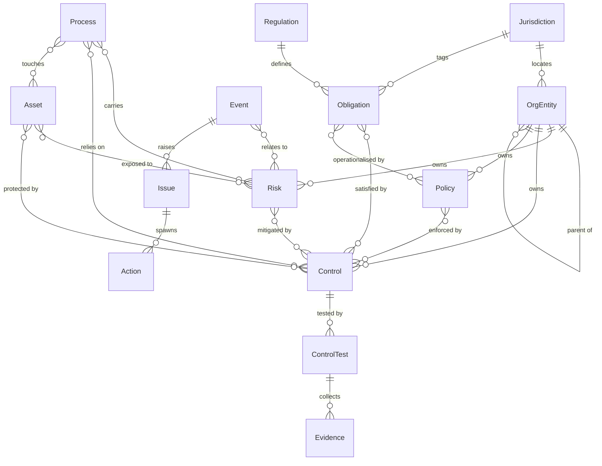

# 02 — Core Data Model ★

This is the heart of the platform. Get it right and every module benefits; get it wrong and no amount of module polish will save the system. The goal is a **canonical core with governed local extensions** that links the GRC entities into one relationship graph — the single source of truth.

> This file is the **conceptual** model. Field-, enum-, and lifecycle-level detail (what a build follows to create tables and state machines) lives in [`02a-data-model-spec.md`](02a-data-model-spec.md).

## Design rules (apply to every entity)

1. **Stable unique ID.** Every record has an immutable surrogate key plus a human-readable reference code.
2. **Owning organisational entity.** Every domain record references an `org_entity` for access-scoping and roll-up (see `03`).
3. **Canonical definition, governed extensions.** One shared schema per entity type. Local variation is added through governed custom fields (structured JSON), never by a module redefining the entity.
4. **Versioned & soft-deleted.** Full change history; records are retired, not hard-deleted, to preserve auditability.
5. **Audited.** Every create/update/retire is written to the append-only audit trail (see `05`).
6. **Relationships are first-class.** The links between entities carry as much meaning as the entities themselves, and are modelled explicitly (association tables), usually many-to-many.

## Entity catalog

| Entity | Purpose | Key attributes (illustrative) |
|---|---|---|
| `OrgEntity` | Organisational/legal unit; the hierarchy node used for scoping and roll-up | id, code, name, type (region/country/legal_entity/business_unit), parent_id, jurisdiction_id |
| `Jurisdiction` | A country/regulatory region; carries data-residency rules | id, code, name, residency_policy |
| `Regulation` | A source instrument (law, standard, framework) | id, name, jurisdiction_id, version, effective_date |
| `Obligation` | A discrete requirement derived from a regulation; jurisdiction-tagged | id, regulation_id, jurisdiction_id, reference, text, owner |
| `Policy` | Internal policy operationalising obligations | id, code, title, version, status, owner, org_entity_id |
| `Risk` | Risk register entry | id, code, title, category, inherent_rating, residual_rating, appetite, owner, org_entity_id |
| `Control` | Control library entry; may be group-shared or entity-local | id, code, title, type (preventive/detective/corrective), framework_ref, owner, org_entity_id |
| `Process` | Business process | id, code, name, owner, org_entity_id |
| `Asset` | IT/information asset, managed by class | id, code, name, asset_class, criticality, owner, org_entity_id |
| `Vendor` | Third party / supplier *(reserved for TPRM wave; defined now so the taxonomy pre-provisions it)* | id, code, name, tier, org_entity_id |
| `DataFlow` | Processing/data-flow record *(reserved for Privacy wave)* | id, name, source, destination, data_categories, jurisdiction_id |
| `Event` | Event/incident capture | id, code, title, occurred_at, severity, org_entity_id |
| `Issue` | Deficiency/finding | id, code, title, source, status, severity, org_entity_id |
| `Action` | Corrective/preventive action (CAPA) | id, issue_id, description, owner, due_date, status |
| `ControlTest` | A test/assessment of a control | id, control_id, scheduled_for, performed_at, result |
| `Evidence` | Artifact supporting a test/attestation | id, kind, uri_or_blob_ref, hash, collected_at |
| `Attestation` | A sign-off (e.g. policy acceptance, control owner attestation) | id, subject_ref, user_id, attested_at |
| `User` `Role` `Permission` | Identity & access (see `05`) | — |
| `AuditLogEntry` | Append-only, tamper-evident change record (see `05`) | id, actor, action, target_ref, before, after, ts, prev_hash, hash |

## Core relationships

| Relationship | Cardinality | Meaning |
|---|---|---|
| Risk ↔ Control | many-to-many | a risk is mitigated by one or more controls |
| Control ↔ Obligation | many-to-many | **one control can satisfy obligations across many regulations/jurisdictions** — the key to multi-jurisdiction efficiency |
| Obligation → Regulation | many-to-one | obligations derive from a regulation |
| Obligation → Jurisdiction | many-to-one | obligations are jurisdiction-tagged |
| Policy ↔ Obligation | many-to-many | policies operationalise obligations |
| Policy ↔ Control | many-to-many | policies are enforced by controls |
| Process ↔ Risk / Control / Asset | many-to-many | a process carries risks, relies on controls, touches assets |
| Asset ↔ Risk / Control | many-to-many | assets have risks and are protected by controls |
| Event ↔ Risk / Control / Asset | many-to-many | an event may reveal a control failure |
| Event → Issue | one-to-many | an event can raise issues |
| Issue ↔ Control / Risk | many-to-many | issues attach to the controls/risks they concern |
| Issue → Action | one-to-many | an issue spawns corrective actions |
| ControlTest → Control | many-to-one | a test evaluates a control |
| ControlTest → Evidence | one-to-many | a test collects evidence; a failed test → Issue |
| every domain entity → OrgEntity | many-to-one | scoping and roll-up |

## Entity-relationship diagram (core)

## The regulation-to-control matrix

Because obligations are jurisdiction-tagged and `Control ↔ Obligation` is many-to-many, a single control (e.g. "access reviews performed quarterly") can be shown to satisfy the equivalent obligation in Singapore, Australia, Japan, and elsewhere at once. This is what stops each subsidiary from re-implementing the same control per country, and it is only possible because the relationship is modelled explicitly. Coverage and gap views fall out of querying this matrix.

## Governed extension mechanism

Local needs (an extra field a given entity requires) are met with a **governed custom-field** facility: a central catalog defines allowed extension fields per entity type; records store their values in a structured JSON column validated against that catalog. This gives local flexibility without letting the canonical schema fork. Ungoverned free-form fields are not permitted on core entities.

## Reserved-for-later entities

`Vendor` (TPRM) and `DataFlow` (privacy) are defined now but not surfaced as modules until Waves 2–3. Defining them at foundation time means the taxonomy already has a home for third parties and data flows, so later waves extend rather than restructure — exactly the day-one reservation the charter requires.
