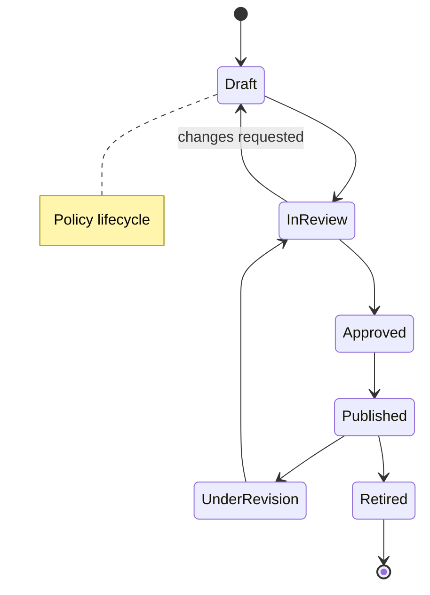
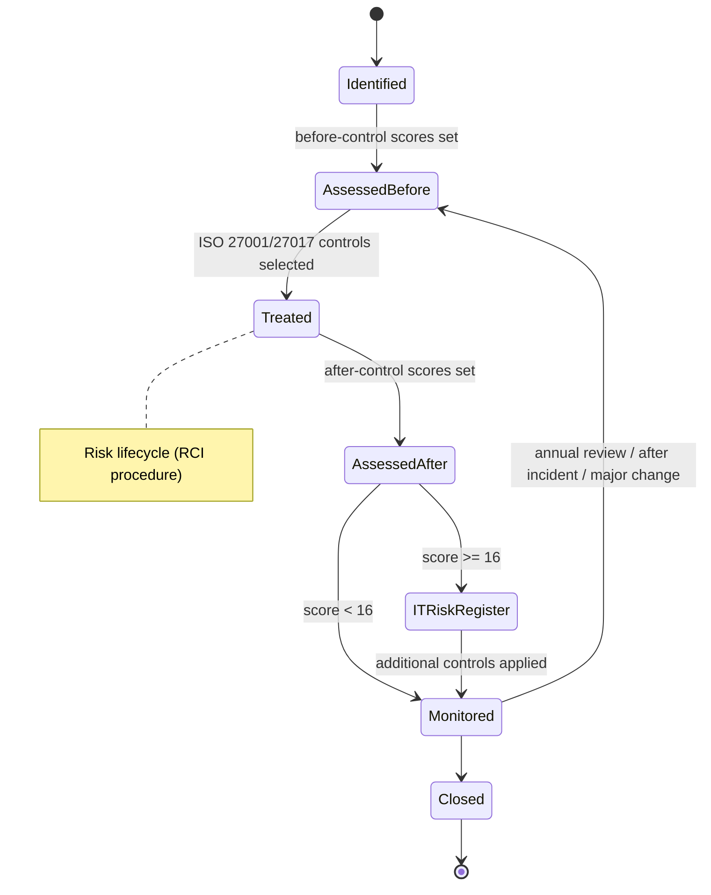
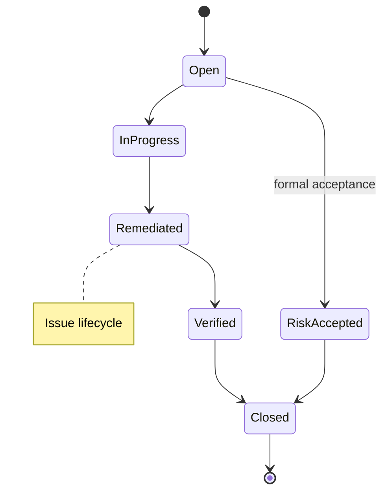
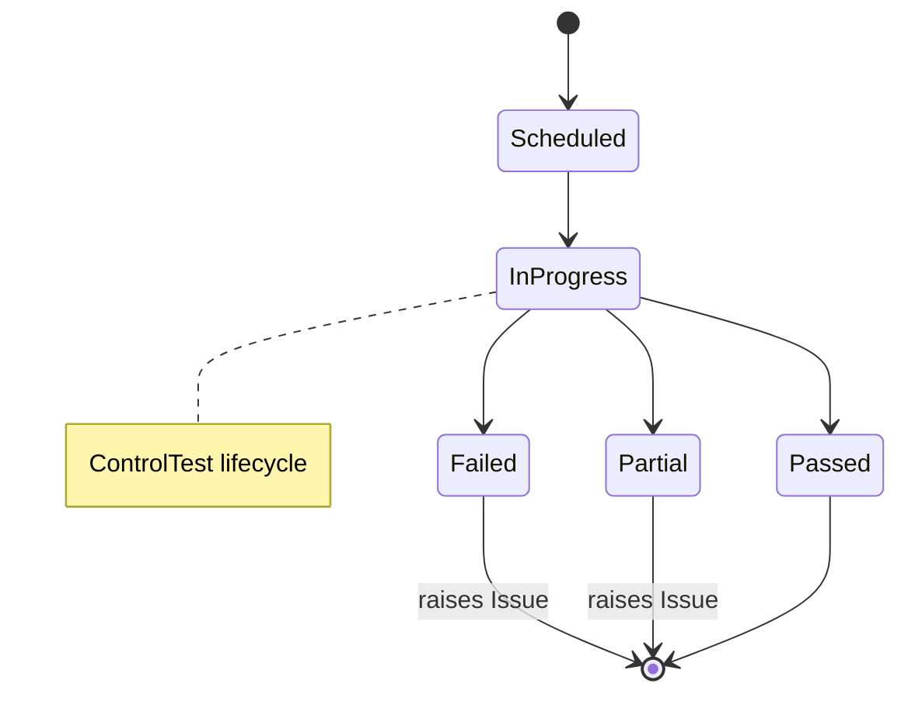

# 02a — Data Model Detailed Spec

The field-, enum-, and lifecycle-level detail behind the conceptual model in `02`, for the
**shared core**. Values marked **(assumption — confirm)** are sensible defaults chosen as the
expert; flag any you want changed.

> ⚠️ **This document is not the whole data model.** Module-specific entities are specified in
> their module documents (`11`, `12`, `13`, `17`). §0 below is the **complete index** — start
> there when creating tables, not here.
>
> This split is deliberate (decided 2026-08-07, CH-003): shared entities live here so no module
> can invent a private definition of them (**guardrail 3**), while module-local entities stay next
> to the source form and workflow they were derived from. The index is what keeps the split
> navigable.

## 0. Entity index — the complete buildable list

**Every entity in the platform, and where its fields are specified.** Nothing is buildable that is
not on this list; adding an entity means adding a row here in the same change. ⚠️ **Enforced since W08** by `scripts/lint/check_entity_index.py` (`run_all` 7/7): a model on neither this index nor its explicit `EXCLUDED` list fails the build. Deliberate exclusions are infrastructure tables carrying none of the §1.1 base fields — today just `RefCodeCounter`, which *issues* `ref_code` rather than carrying one. This paragraph is appended in place rather than expanded into a subsection because ~300 `file:line` anchors point into this document.

### Shared core — specified in this document (§3)

| Entity | Wave | Note |
|---|---|---|
| `OrgEntity` | 1 | The scoping and roll-up spine |
| `Jurisdiction` | 1 | ⚠️ **Specified** without the `cross_border_*` / `deployment_region` columns — no consumer since `CH-008`. The table itself is built in M2 (§3) |
| `Regulation` · `Obligation` | 1 | Foundation-ready; surfaced as a module in Wave 2 |
| `Policy` | 1 | ⚠️ See §0.1 — known field gaps |
| `Risk` | 1 | Five impact types, before/after control |
| `Threat` · `Vulnerability` | 1 | Reusable libraries |
| `AssetGroup` · `Asset` | 1 | Promoted to Wave 1 — risk assessment is asset-based |
| `StatementOfApplicability` | 1 | Mandatory ISO 27001 output |
| `Control` | 1 | |
| `Assessment` (RCSA) | — | ⛔ **NOT A SEPARATE TABLE.** An RCSA is an `AssessmentInstance` whose `subject_type` is `risk` — this row is kept so the old name still finds its home. Ruled by the user 2026-08-13 on the column overlap: §3's `Assessment` gives `subject_type`+`subject_id`, `period`, `assessor_user_id`, `reviewer_user_id` and two timestamps, while `AssessmentInstance` gives the same fields with `assignee_user_id` for the first and `status` for the last two — and §4 defines **one** lifecycle for the pair. Building both would be one concept with two private definitions, which guardrail 3 forbids. ⚠️ **The ruling had a cost, since paid**: §3's `Assessment` enumerates `risk/control/**process**/entity` while the engine's was `risk/control/**vendor**/entity` (:326 and `05:43`, twice), so `process` briefly had no home. **Closed 2026-08-13 by CH-025** — the user ruled `process` into the engine's enum (:326 now lists five), because losing a subject kind was a side effect of collapsing two tables rather than anything anybody chose |
| `ControlTest` | 1 | |
| `Evidence` | 1 | Polymorphic |
| `Issue` · `Action` (CAPA) | 1 | Shared by every module that raises findings |
| `Event` | 1 | **Extended into the incident record by `11`** |
| `Attestation` | 1 | |
| `RiskManagementReport` · `RMReportVersion` | 1 | §3.1 — versioned snapshot over the live register |
| `extension_field_catalog` | 1 | §1.3 |
| `posture_snapshot` | 1 | §7 — dashboard data source. **Built in W18** with the seven columns §7 lists; ⚠️ the five replication columns stay **unbuilt** (`CH-008`, §7's banner, ADR-0010) |

### Foundation services — specified in this document (§3.2), described in `05`

| Entity | Wave | Described in |
|---|---|---|
| `User` | 1 | `05` §Identity · **scope semantics settled by [ADR-0012](../14-adr/0012-user-scope-semantics.md)** — the one entity with **no** `org_entity_id` besides `OrgEntity` |
| `audit_log` | 1 | `05` §Audit trail · design is ADR-0003 |
| `retention_policy` · `LegalHold` | 1 | `05` §Records retention |
| `AccessRequest` · `AccessReviewCampaign` | 1 | `05` §Access management |
| `AssessmentTemplate` · `AssessmentInstance` · `AssessmentResponse` | 1 | `05` §Shared assessment engine |

### Module-local — specified in their module document

| Entity | Wave | Specified in |
|---|---|---|
| `IncidentHistoryEntry` · `RootCauseAnalysis` (+ `Event` extension) | 2 | [`11`](11-security-incident-module.md) §Data model |
| `Vendor` · `VendorEvaluation` · `ExternalPartyRiskAssessment` · `VendorServiceAudit` | 2 | [`12`](12-supplier-management-module.md) §Data model |
| `ISMSProfile` · `ISMSSite` · `ISMSContact` · `ApprovedOffering` · `ISMSProfileVersion` | 1 | [`13`](13-isms-profile-module.md) §Data model |
| `AuditIssue` · `CorrectiveActionPlan` | 2 | [`17`](17-audit-issues-module.md) §Data model |

### Not yet specified — must not be built until they are

| Concept | Blocked on |
|---|---|
| OS portfolio (regional offering catalogue with certification position) | `AD-DesignAlign-5` — module not yet specified |
| Risk programme module **UI** (the entities exist; the screens do not) | `AD-DesignAlign-5` |
| Report schedules · notification rules | `AD-Model-Gaps` — described in `05`, no entity decided |
| Governance bodies (ISC / ITSC) as approvers | `AD-Model-Gaps` — approvals are currently modelled as users only |
| `Role` · `Permission` (and the `(user, role, entity_scope)` assignment) | **M4** — named in `02:37`, described in `05` §Identity, but no field-level spec. ⛔ Not built in W04: zero consumers until a real credential source exists. [ADR-0012](../14-adr/0012-user-scope-semantics.md) makes the assignment the expected home of entity scope |

### §0.1 Known field-level gaps in this document

Recorded so they are not mistaken for completeness. Sources are the design handoff's sample data
(audited in [`../09-analysis/mockup-data-vs-spec-audit-20260807.md`](../09-analysis/mockup-data-vs-spec-audit-20260807.md)).

| Entity | Gap | AD |
|---|---|---|
| `Policy` | No file metadata (name / format / size / pages / upload date), no table of contents, no per-policy version array. Only `body_ref` | `AD-Model-Gaps` |
| `OrgEntity` | No OpCo **function** field (Regional HQ / Supply chain / Sales & service). `type` is structural, this is a different axis | `AD-Model-Gaps` |
| `Event` / `11` | `business_unit` is free text in the sample data but a hierarchy node in `OrgEntity.type`. **Not interchangeable — decide** | `AD-Model-Gaps` |

## 1. Conventions

### 1.1 Base fields (every domain entity has these)

| Field | Type | Notes |
|---|---|---|
| `id` | UUID | Surrogate primary key, immutable |
| `ref_code` | string | Human-readable, unique (e.g. `RISK-SG-000123`); prefix by type + entity |
| `org_entity_id` | UUID FK → OrgEntity | **Required** — the owning entity; drives scoping and roll-up |
| `status` | enum | Per the entity's state machine (§4) |
| `owner_user_id` | UUID FK → User | Accountable owner |
| `version` | int | Incremented on change; full history retained |
| `extensions` | JSONB | Governed custom fields, validated against the extension catalog |
| `created_at` / `created_by` | timestamp / UUID | Audit |
| `updated_at` / `updated_by` | timestamp / UUID | Audit |
| `retired_at` | timestamp, nullable | Soft-delete marker; records are retired, never hard-deleted |
| `is_active` | bool | Derived convenience flag |

### 1.2 ID & reference scheme

- Surrogate `id` (UUID) for all joins.
- `ref_code` for humans: `<TYPE>-<ENTITY_CODE>-<seq>`; stable once issued.

### 1.3 Extension mechanism

A central `extension_field_catalog` defines allowed custom fields per entity type (name, data type, validation, whether required). Records store values in `extensions` JSONB validated against the catalog. No ungoverned free-form fields on core entities.

## 2. Enumerations & scales

| Enum | Values | Notes |
|---|---|---|
| Risk likelihood (LKH) | 1 Rare · 2 Unlikely · 3 Possible · 4 Likely · 5 Almost certain | 5-point, with probability bands per the RCI procedure (e.g. 5 = >1 in 10; 1 = 1 in 10,000–100,000) |
| Risk impact | 1 Insignificant · 2 Minor · 3 Moderate · 4 Major · 5 **Catastrophic** | 5-point, scored **across five impact types** — see below |
| Impact type | FIN Financial · BOP Business Operations · LRY Legal & Regulatory · REP Reputation · SIS Sensitive Information & Life Safety | Each scored 1–5 independently |
| CIA type | C · I · A (any combination) | Which security property the risk affects |
| Risk score | 1–25 integer | `LKH × MAX(FIN, BOP, LRY, REP, SIS)` |
| Risk acceptance | acceptable (<16) · requires treatment (≥16) | Per the RCI risk acceptance criteria |
| Treatment | accept · mitigate · transfer · avoid | |
| Control type | preventive · detective · corrective | |
| Control nature | manual · automated · hybrid | |
| Control frequency | continuous · daily · weekly · monthly · quarterly · annual · event-driven | |
| Control effectiveness | not_tested · effective · partially_effective · ineffective | |
| Test result | pass · partial · fail | fail/partial → raises an Issue |
| Issue severity | low · medium · high · critical | |
| Posture (RAG) | green · amber · red | Derived for dashboards |
| Attestation result | acknowledged · exception_requested | |

> **Standardisation decision — CONFIRMED:** use **group-standard scales** across all entities, with **governed per-entity calibration** allowed only through configuration where a subsidiary genuinely needs it. This directly serves the "inconsistent practices" pain point. (Rejected alternative: fully per-entity scales — reintroduces the fragmentation we're solving.)

### Risk scoring model (aligned to the RCI Risk Management Procedure)

```
Risk = Likelihood (1–5)  ×  MAX(FIN, BOP, LRY, REP, SIS)   →  1–25
```

- Impact is **multi-dimensional**: each of the five impact types is scored 1–5, and the **maximum** is taken as the overall impact. Store all five — the maximum is derived, not entered.
- Scored **twice**: `before_control` (inherent) and `after_control` (residual), each with its own LKH + five impact scores + derived score.
- **Acceptance criteria:** score < 16 is acceptable (though cost-effective improvement should still be considered); **score ≥ 16 requires controls** to be established to reduce it. If the **residual** score is still ≥ 16 after all necessary controls, the residual risk is recorded in the **IT Risk Register**.
- The financial thresholds and descriptors per impact type (e.g. FIN 5 = >25% of budget or >$5M) come from the procedure's impact table and are held as **configuration**, so the second line can maintain them without code changes.

> **Where this lives, as built (W05, [ADR-0013](../14-adr/0013-risk-scoring-and-calibration.md)):**
> the four derived values (`score_before`, `score_after`, `acceptance_status`, `in_it_risk_register`)
> are **PostgreSQL generated columns** — computed in the same statement as their inputs, so a
> supplied value is a hard error rather than a field that silently loses. The threshold 16 is a
> **constant in the migration expression**, not a configuration row: `risk_scales` has never been
> specified anywhere, so building it today would mean inventing its columns (已確認參數 #9).
> ⚠️ Two consequences the next reader needs: each score set is **all-or-none** (`GREATEST` ignores
> NULL, so a half-filled set would compute a plausible wrong number), and an **unassessed** risk
> reads NULL on all four — not `acceptable`. Per-entity calibration remains a mechanism this
> design owes; ADR-0013 records what must become true before it is built.

## 3. Entity field specifications (Wave 1)

Only entity-specific fields are shown; every entity also carries the §1.1 base fields.

**OrgEntity** — `type` (region/country/legal_entity/business_unit), `parent_id` (FK → OrgEntity, nullable for root), `jurisdiction_id` (FK), `path` (materialised hierarchy path for fast roll-up).

**Jurisdiction** — `code` (ISO country/region), `name`, `residency_policy` (enum: none/conditional/localised), `notes`, plus the residency configuration below.

> ### ⚠️ Residency & cross-border configuration — **NOT BUILT in Wave 1**
>
> China left scope on **2026-08-08** (`CH-008`, ADR-0010) and was the only in-scope jurisdiction
> with a localisation requirement. **These fields have no consumer.** Creating them, and the
> database-layer enforcement rule below, would be **AP-5 speculative abstraction**
> (`CLAUDE.md` §禁止反模式).
>
> **Retained as a specification, not a backlog item.** The design work (CH-001's field tiering,
> the enforcement placement argument) is genuinely hard to re-derive and is cheap to keep on paper.
> Build it the day a jurisdiction actually requires it — and re-read ADR-0010 §可證偽條件 #1 first,
> because at that point the topology decision itself reopens.
>
> `Jurisdiction` **is** built in M2 — it carries jurisdiction tagging for the obligation library
> (`10` frameworks-first). It is only the `cross_border_*` / `deployment_region` columns below
> that are deferred.

*Residency & cross-border configuration (specification only — see banner above).* The classification these fields govern is in [`03-multi-entity-and-jurisdiction.md`](03-multi-entity-and-jurisdiction.md) §Cross-border data classification. Holding this as **configuration rather than code** is what would let the legal position change without re-architecture, and what would make "what crossed the border" evidenceable (guardrail 2).

| Field | Type | Notes |
|---|---|---|
| `deployment_region` | enum / FK | Which physical deployment hosts this jurisdiction's data. **This field is what makes the topology configuration instead of a code branch** (ADR-0006) |
| `cross_border_max_tier` | enum: `none` / `aggregate` / `aggregate_plus_reference` / `full` | Highest tier permitted to leave. Maps to T1 / T1+T2 / all in `03` |
| `cross_border_metric_allowlist` | text[] , nullable | `posture_snapshot.metric_key` values permitted to leave. `NULL` = all tier-1 metrics, when `cross_border_max_tier ≥ aggregate`. Non-null narrows it (e.g. `{posture_rag}` only) |
| `cross_border_pseudonymise_actors` | bool | Replace personal identifiers (risk owner, assessor, attester) with a pseudonym or role code before transfer. **Removes the PIPL surface from tier 2** without touching the posture data |
| `cross_border_requires_approval` | bool | Each period's transfer needs recorded human sign-off before replication |
| `cross_border_legal_basis` | text | The basis relied upon. Not decoration — it is the evidence produced when the platform is asked to justify a transfer |
| `cross_border_reviewed_at` / `cross_border_reviewed_by` | timestamp / UUID | Legal positions expire. A stale review is a finding, not a default |

**Enforcement rule (not optional):** a `posture_snapshot` row may be replicated out of its
`deployment_region` **only** if its `metric_key` passes the owning jurisdiction's
`cross_border_max_tier` and `cross_border_metric_allowlist`. Enforce this **at the database
layer** alongside the entity-scoping RLS (ADR-0004), not in application code — the failure mode
of an application-only check is a silent, unlogged transfer, which is the one outcome that
cannot be remediated after the fact.

**Regulation** — `name`, `jurisdiction_id` (FK), `version`, `effective_date`, `source_url`.

**Obligation** — `regulation_id` (FK), `jurisdiction_id` (FK), `reference` (clause), `text`, `summary`. *(Foundation-ready; surfaced as a module in Wave 2.)*

**Policy** — `title`, `category`, `version`, `effective_date`, `review_due`, `body_ref` (document store pointer), `requires_attestation` (bool).

**Risk** — `title`, `category`, `description`, `asset_id` (FK → Asset), `threat_id` (FK → Threat), `vulnerability_id` (FK → Vulnerability), `cia_type` (C/I/A combination), `risk_owner_user_id`, `treatment`, `review_due`, and two score sets:
- *before control*: `lkh_before`, `fin_before`, `bop_before`, `lry_before`, `rep_before`, `sis_before`, `score_before` (derived = LKH × MAX(impacts))
- *after control*: `lkh_after`, `fin_after`, `bop_after`, `lry_after`, `rep_after`, `sis_after`, `score_after` (derived)
- `acceptance_status` (derived: acceptable / requires treatment, threshold 16), `in_it_risk_register` (bool — true when `score_after` ≥ 16)

**Threat** — `name`, `description`, `category`. A reusable library (e.g. "Espionage and Intellectual Theft", "Unauthorized Logical Access").

**Vulnerability** — `name`, `description`, `category`. Reusable library (e.g. "Insufficient Visitor Control and Monitoring").

**AssetGroup** — `name`, `asset_category` (services / people / intangible / physical & virtual / software / information), `description`. Groups assets for assessment, per the Risk Management Report structure.

**StatementOfApplicability (SoA)** — `framework_id`, `clause_ref` (e.g. ISO 27001 A.5.9), `applicable` (bool), `justification`, `implementation_status`, `org_entity_id`, `version`, `approved_by`, `approved_at`. A mandatory ISO 27001 artifact, derived from which controls were selected during risk treatment. ⚠️ **Recorded deviation (W11), three parts.** (1) `framework_id` is built as **`framework`, a string and not a foreign key** — `Framework` is on no section of the §0 index, whose first sentence is that nothing off it is buildable, and the word appears nowhere in this document, so the spec has never said what one would contain. Identical to the ruling W06 made for `Control.framework_refs` (:217), and the exit is the same: when `Framework` arrives these columns become the migration's **input**, not a second source of truth kept beside it. The name drops `_id` because it should not claim an edge that does not exist. (2) **No `control_id`** — "derived from which controls were selected" is a derivation, and this line's field list gives no column for it; inventing one would be inventing a field (confirmed parameter #9). Today the link is `clause_ref` matching a string inside `Control.framework_refs`, a correspondence a human can see and a query cannot follow (`AD-Model-Gaps`). (3) `implementation_status`'s **values are self-declared** (`implemented` / `partially_implemented` / `not_implemented` / `planned`) because this line names the column and no values — recorded in the schema docstring per the W04 D3 ruling, not in a registry nobody asked for. It deliberately **excludes `not_applicable`**: `applicable` is already a boolean on the same row, and two columns stating one fact have no reconciliation rule — the judgement that removed `ControlTest.result` (:225) and `RMReportVersion.state` (:260).

**Control** — `title`, `description`, `type`, `nature`, `frequency`, `framework_refs` (array, e.g. ISO 27001 A.x), `applies_to_scope` (this entity only / subtree / group-shared), `effectiveness` (from latest test).

> ⚠️ **Implemented in W06 with TWO of the three `applies_to_scope` values** (`entity`, `group`); **`subtree` is deliberately absent** — **ADR-0014**. Nothing can honour it today: scope resolution expands downward only (`entity-scope.resolver.ts:120-142` — assignment roots plus descendants, never ancestors), so a child's scope never contains the parent that would own a subtree control. Shipping the value would be a setting that changes nothing and reports nothing (AP-3). Restoring it needs an ancestor lookup **inside the policy**, which is what §146's materialised `path` exists to avoid — see ADR-0014 §可證偽條件. **This is a recorded deviation from this line, not an oversight.**

**Asset** — `name`, `asset_group_id` (FK → AssetGroup), `asset_category`, `classification` (Internal / Restricted / Confidential), `value`, `criticality`, `asset_owner_user_id`, `custodian_user_id`. **Promoted to Wave 1** — the RCI risk methodology is asset-based, so the Asset Inventory is a prerequisite for risk assessment, not a later module.

**Assessment (RCSA)** — `subject_type` + `subject_id` (polymorphic: risk/control/process/entity), `period`, `assessor_user_id`, `submitted_at`, `reviewer_user_id`, `reviewed_at`, `result`. Lightweight first-line self-assessment.

**ControlTest** — `control_id` (FK), `scheduled_for`, `performed_at`, `tester_user_id`, `reviewer_user_id`, `result`, `conclusion`. ⚠️ **Recorded deviation (W07)**: `result` is **not built** — §4's five-state lifecycle already carries it in its three terminal states (Passed / Partial / Failed), and two columns saying the same thing have no reconciliation rule; `status` carries it. `control_id` has **no composite FK** (`Control` refuses the `(id, org_entity_id)` anchor for the M7 link table), so cross-entity references are refused by a `BEFORE INSERT OR UPDATE` trigger — see `design-notes/W07-cross-entity-references.md`.

**Evidence** — `kind`, `uri_or_blob_ref`, `hash` (integrity), `collected_at`, `linked_type` + `linked_id` (polymorphic to test/attestation/assessment). ⚠️ **Recorded deviation (W07)**: `linked_type` is built with **one** value, `control_test` — `Attestation` and `Assessment` do not exist, and an enum value naming an absent table is a setting nobody can exercise (the judgement that removed `applies_to_scope = subtree` in ADR-0014). `linked_id` has **no foreign key at all** while it stays polymorphic; the same trigger supplies both the integrity check and the scope guard.

**Issue** — `title`, `source` (enum: assessment/test/audit/incident/manual), `severity`, `description`, `due_date`.

**Action (CAPA)** — `issue_id` (FK), `description`, `assignee_user_id`, `due_date`, `completed_at`, `verified_by`.

**Event / Incident** — `title`, `occurred_at`, `detected_at`, `severity`, `description`, `loss_amount` (nullable).

**Attestation** — `subject_type` + `subject_id` (polymorphic: policy/control), `user_id`, `attested_at`, `result`.

### 3.1 Risk Management Report — a versioned snapshot, not a second copy ⭐

**Decided 2026-08-07 (CH-003), confirming `15` §3.1.** The design handoff ships two incompatible
risk shapes: `risks.js` (`imp`, `lik`, `inh`) and `riskRegister.js` (`item`, `tv`, `existing`,
`add`, `who`, `target`, `score` — no likelihood or impact at all). They are **not two entities**.

- The **live risk register** (`Risk`, above) is the working data — the single source of truth.
- The **Risk Management Report** is the point-in-time **controlled deliverable produced from it**,
  versioned as a whole and approved by the Information Security Committee.
- `riskRegister.js`'s shape is the *rendered register sheet* of such a snapshot, **not a store**.

> **Why this matters beyond tidiness.** Two stores of risk data would drift, and guardrail 3
> forbids a module holding its own private definition of a shared entity. It is also the same
> pattern as `posture_snapshot` (§7): live data plus periodic immutable snapshots, rather than
> parallel records.

**RiskManagementReport** — `org_entity_id` (scope of the report), `title`, `current_version_id`.

**RMReportVersion** — `report_id` (FK), `version_label` (e.g. `2025.7` — **not** semver; the
source uses year-based labels), `prepared_by` (see note), `approved_by`, `effective_date`,
`change_note`, `state` (current / superseded), `snapshot_at`, plus the frozen sheet payload
(Services · Assets · Threats · Risk assessment · Treatment).

> ⚠️ **Recorded deviation (W10): `state` is NOT built.** Same form as `ControlTest.result` (:225)
> and `applies_to_scope = subtree` (:219) — a specified value deliberately absent, with its reason
> on file. `state` and `RiskManagementReport.current_version_id` (:253) are two representations of
> one fact with no reconciliation rule, and they cannot coexist here: flipping `state` to
> `superseded` is an UPDATE on a row the next bullet says is never edited. Keeping only the parent
> pointer is what lets `rm_report_versions` carry **no `FOR UPDATE` policy at all** (ADR-0014 —
> an absent policy is stricter than a narrow one), so "at most one current version" holds by
> construction rather than by index, and *superseded* is derived: a version is current iff its
> report's `current_version_id` names it. Both halves measured in W10 Day 3 (N1a/N1b).

- Snapshots are **immutable**: correcting a report means issuing a new version, never editing one.
- Retention is **3 years per version** (`05`, `retention.js`) — versions are archived, not deleted.
- ⚠️ `rmVersions.js` records `by:'ITSC'` and `appr:'ISC'` — **governance bodies, not users.**
  `02a` currently models approvers as `user_id` only. Modelled as free text for now; whether
  committees become first-class actors is `AD-Model-Gaps`. **Do not silently coerce a committee
  into a user record** — that would misstate who approved.

### 3.2 Foundation-service entities

Described in `05`; fields specified here so §0's index resolves to one place. Sources are `05`
plus the design handoff's `accessRequests.js`, `accessReviews.js`, `sessionPolicy.js` and
`retention.js`.

**User** — `oidc_subject` (the IdP's subject claim; unique; the join key to the identity provider),
`email`, `display_name`. Nothing else. Authentication is delegated to an OIDC provider and
**the platform stores no password** (`05` §Identity), so there is no credential column to hold.

> ### ⚠️ `User` is the second table with no `org_entity_id` — and the reason differs from `OrgEntity`'s
>
> `OrgEntity` is global because it *defines* scope. `User` is global because **scope is not a
> property of a person**: `03:31` states that a user's scope is derived from their role
> assignment, and a regional ISO legitimately spans 13 OpCos. Settled in
> **[ADR-0012](../14-adr/0012-user-scope-semantics.md)**, which also records the cost —
> a global table of people is cross-entity readable by construction, so **who may enumerate
> users is an M4 application-layer decision, not something RLS answers**.
>
> **Which §1.1 base fields apply**: `id` · `version` · `created_at` / `updated_at` · `retired_at`.
> **Which do not, and why**: `org_entity_id` (above) · `ref_code` (the `<TYPE>-<ENTITY_CODE>-<seq>`
> scheme is entity-scoped by construction; a person has no owning entity) · `status` (§4 defines
> no user lifecycle — account state belongs to the IdP) · `owner_user_id` (a person is not owned)
> · `created_by` / `updated_by` (users arrive from the IdP, not from another user's action —
> revisit at M4 if administrative provisioning is added) · `extensions` (no governed-extension
> need has been shown for identity data; add it the day one is).
>
> ⛔ **Deliberately absent, do not add without a consumer**: `home_org_entity_id` (an employer
> field would be read as the scope anchor — the exact misreading ADR-0012 exists to prevent),
> `last_login` (no consumer), any role or permission column (**M4**, see §0's not-yet-specified
> table).

**audit_log** — see `rules-on-demand/multi-tenant-data.md` §稽核軌跡 for the field list and the
hash-chain columns. Design is **ADR-0003** (open). Two properties are settled regardless:
append-only (no `UPDATE`/`DELETE`, ever) and **pseudonymous actors, never personal data** — the
latter is what reconciles the erasure right with guardrail 5.

**retention_policy** — `record_class`, `duration`, `trigger` (creation / closure / supersession),
`disposition` (retain / archive / purge), `basis` (the citation, e.g. `ISO 27001 A.5.28`),
`review_cadence`. The six confirmed classes and periods are in `05` §Records retention.

**LegalHold** — `scope_type` + `scope_id` (polymorphic: record / class / entity), `reason`,
`applied_by`, `applied_at`, `released_by`, `released_at`, `status`. A hold **suspends disposal
regardless of retention period**, is applied and released by authorised roles only, is itself
audited, and records under hold must be **visibly flagged** in the UI.

**AccessRequest** — `ref_code`, `requester_user_id` **or** `external_party_name` (⚠️ nullable
user: `accessRequests.js` shows `who:'External — BSI auditor'` with `opco:'—'`), `org_entity_id`
(nullable, for external requesters), `requested_access`, `business_reason`, `grant_duration`
(⚠️ time-boxed grants are real — `'Auditor (read-only) — 14 days'`), `approver_role`,
`status` (pending / approved / rejected), `decided_by`, `decided_at`.

> The nullable-user and duration fields are load-bearing: they are what make **just-in-time
> auditor access** (`05`) expressible. Modelling requesters as internal users only would force
> external auditors into permanent accounts — the opposite of the control.

**AccessReviewCampaign** — `name`, `scope_description`, `due_date`, `owner_user_id`,
`items_total`, `items_completed`, `status`. Per-reviewer progress is derived from its items.

**AssessmentTemplate** — `name`, `version`, `subject_type` (risk / control / **process** /
vendor / entity), sections, and questions with `question_type` (yes-no-NA / score / free text)
and `evidence_required` (bool).

> ⚠️ **`process` added 2026-08-13 (CH-025), by ruling rather than by reading.** This line and
> `05:43` originally gave four subject kinds; §3's `Assessment` (RCSA) gave four *different*
> ones, each list holding one the other lacked. W09 built only the four both agreed on and
> recorded the difference. The user then ruled that `process` belongs here — losing a whole
> subject kind had been a side effect of collapsing `Assessment` into `AssessmentInstance`
> (a decision made on the column overlap), not something anybody chose. The full order is
> `risk, control, process, vendor, entity`: the superset that keeps both original lists in
> their own relative order.

**AssessmentInstance** — `template_id`, `template_version`, `subject_type` + `subject_id`,
`period`, `assignee_user_id`, `reviewer_user_id`, `status`.

**AssessmentResponse** — `instance_id`, `question_id`, `answer`, `evidence_id` (nullable).

> One engine, three consumers: RCSA, control testing and vendor service audits (`05`). SoD applies
> — `reviewer_user_id` ≠ `assignee_user_id`, and for vendor audits the auditor must be independent
> of the relationship manager.

## 4. State machines (lifecycles)





Re-assessment triggers, per the procedure: **at least annually**, **after a security incident**, or on **significant change** (business priorities, operating procedures, new/changed systems, emerging threats).





Other lifecycles follow the same shape: **Action** (Open → InProgress → Completed → Verified), **Assessment/RCSA** (Scheduled → InProgress → Submitted → Reviewed → Completed), **Event** (Reported → Triaged → Investigating → Resolved → Closed).

## 5. Relationship & integrity rules

### 5.1 Cardinality & obligation (key links)

| Link | Cardinality | Mandatory? | Rule |
|---|---|---|---|
| Risk ↔ Control | M:N | a **treated** risk should have ≥1 control | enforced at the Treated transition, not at creation |
| Control ↔ Obligation | M:N | optional | one control may satisfy many obligations across jurisdictions |
| Obligation → Regulation / Jurisdiction | N:1 / N:1 | required | obligations are always sourced and jurisdiction-tagged |
| Issue → Action | 1:N | an open issue needs ≥1 action before it can be Remediated | |
| ControlTest → Control | N:1 | required | |
| every domain record → OrgEntity | N:1 | **required** | scoping/roll-up |

### 5.2 Global rules

- **Scoping:** a relationship should not cross incompatible entity scopes. A group-shared control (`applies_to_scope = group`) may link to any entity's risks; an entity-local control may only link within its own entity/subtree.
- **Segregation of duties:** on `ControlTest` and `Assessment`, `reviewer_user_id` ≠ `owner`/`assessor` of the tested/assessed object; an auditor role cannot edit the controls it assures. Enforced in the review transition.
- **Soft-delete:** retire, never hard-delete. Retiring a record referenced by active links is **restricted** until links are resolved; the audit trail retains the full history regardless.
- **Derivations:** `rating_inherent` / `rating_residual` are computed from the configured matrix; `Control.effectiveness` reflects the latest completed `ControlTest`; posture RAG values are derived, not stored as source of truth.
- **Audit:** every create/update/retire and every state transition writes to the append-only audit trail (see `05`) — no exceptions.

## 6. Data the roll-up dashboard needs (flagship)

The dashboard is the Wave 1 payoff, so the model must expose these aggregations per `OrgEntity` (and roll them up the hierarchy):

| Metric | Aggregates from |
|---|---|
| Risk posture | count of Risk by `rating_residual`, grouped by entity |
| Control coverage | % of risks with ≥1 control; % of controls with `effectiveness = effective` |
| Control assurance | % of controls tested within their `frequency` window |
| Policy adoption | attestation completion rate per policy per entity |
| Open issues | count by `severity` and age, per entity |
| RCSA completion | % of scheduled assessments Completed in the period |

Design consequence: the entities above must carry the status/rating/date fields these metrics read, and every record must be entity-scoped so the roll-up is a hierarchy aggregation over `OrgEntity.path`.

## 7. Open design decisions

1. ~~Risk scale~~ → ✅ **CONFIRMED: 5×5, qualitative.**
2. ~~Standardisation~~ → ✅ **CONFIRMED: group-standard scales with governed local calibration.**
3. ✅ **CONFIRMED: add `posture_snapshot`** — per-entity metric values per period, written by a scheduled job (monthly), enabling trend and point-in-time board reporting. Build it in M1 alongside the core tables. See `08-rollup-dashboard-spec.md`.
4. **RCSA cadence** — quarterly is the working default; confirm with the second line before M7.
5. **Residual automation** — default: the risk owner enters `rating_residual`; the system may *suggest* it from control effectiveness. Confirm before M7.

### `posture_snapshot` (confirmed addition)

| Field | Notes |
|---|---|
| `id` | UUID |
| `org_entity_id` | FK → OrgEntity |
| `period` | e.g. `2026-Q3` or month key |
| `metric_key` | See the fixed set below |
| `metric_value` | numeric |
| `rag` | derived band at capture time |
| `captured_at` | timestamp |

Append-only in practice: snapshots are historical record — do not retro-edit them.

**`metric_key` is a fixed, governed set** — the nine metrics `08` defines. It is not free-form.
The original reason was cross-border classification (`03`), which no longer applies; **the set
stays governed anyway**, because a free-form key means the comparison matrix silently changes
shape when someone adds one, and every entity's row must carry the same metrics to be comparable:

`total_risks` · `high_critical_count` · `control_coverage_risk` · `control_coverage_effective` ·
`overdue_tests` · `open_critical_issues` · `rcsa_completion` · `policy_attestation` · `posture_rag`

> Adding a metric key means classifying it first. Treat the set as governed configuration with a
> review step, the same way the extension field catalog (§1.3) governs custom fields.

#### Replication fields (residency) — **NOT BUILT in Wave 1**

> Same reason as `Jurisdiction` §3's banner: with a single deployment region (ADR-0010) nothing
> replicates, so these five columns have no consumer. **`posture_snapshot` itself is still built**
> — it is the flagship dashboard's data source (`08`), independently of any border.

`posture_snapshot` was designed as the **only** entity that crosses a residency boundary. That
makes the border a narrow, fixed-schema, inspectable interface rather than a continuous
cross-region query — reviewable once by Legal instead of per feature.

| Field | Type | Notes |
|---|---|---|
| `source_region` | enum / FK | Deployment region that computed this row |
| `replicated_to_region` | enum / FK, nullable | `NULL` = never left `source_region`. Non-null is the queryable record that a transfer occurred |
| `replicated_at` | timestamp, nullable | |
| `transfer_approved_by` / `transfer_approved_at` | UUID / timestamp, nullable | Populated when the jurisdiction sets `cross_border_requires_approval` |

Replication is subject to the enforcement rule on `Jurisdiction` (§3) and, like every other state
change, writes to the append-only audit trail — a transfer is an auditable event, not a
background detail.

> **Consequence for dashboard freshness — driver changed, conclusion survives.** The original
> concern was China's monthly replication mixing as-at times with live-queried OpCos; with one
> region that mismatch is gone. **But the fix is still right for a different reason**: a matrix
> that computes some cells live and reads others from a snapshot compares different instants
> regardless of geography. Read the matrix from `posture_snapshot` for **all** entities (uniform
> as-at), keep live queries for drill-down. Confirm before M8 (`AD-Residency-1`, re-based).
