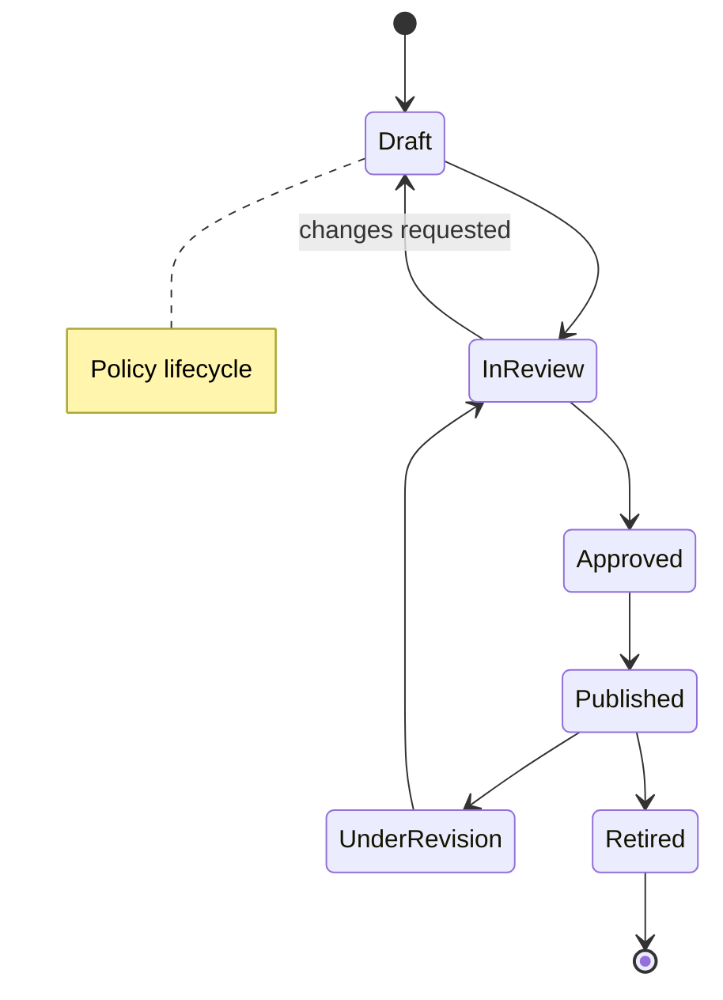
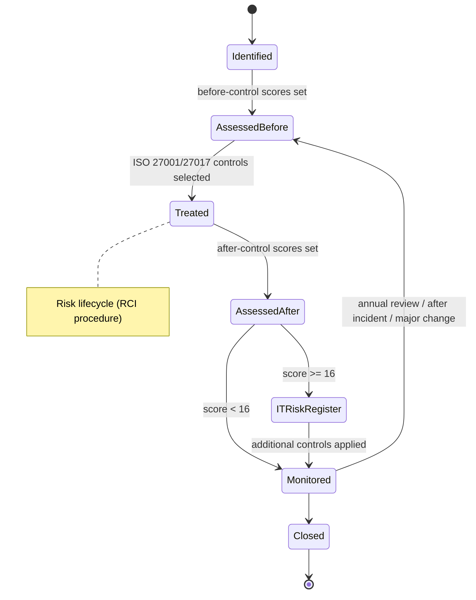
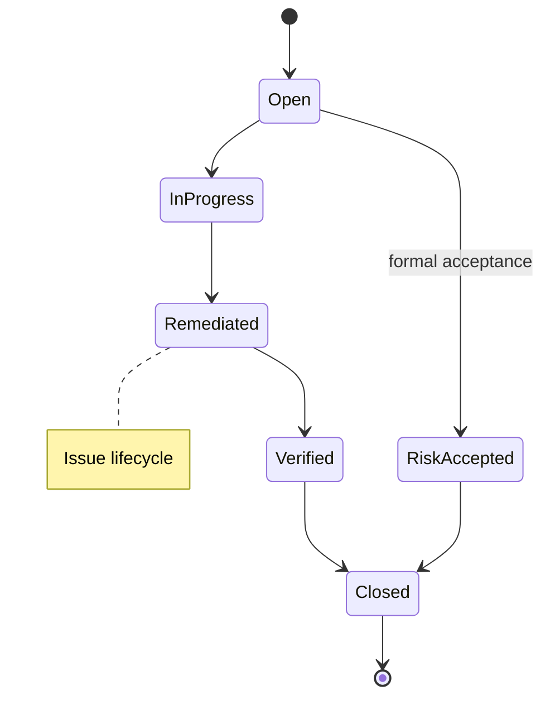
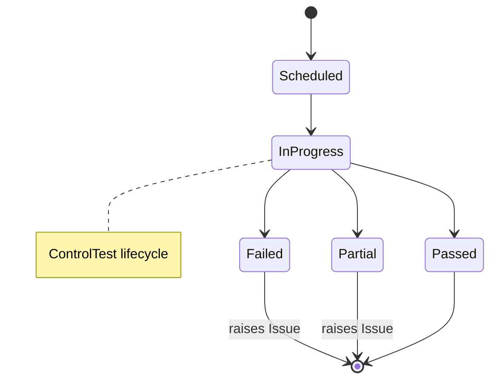

# 02a — Data Model Detailed Spec

The field-, enum-, and lifecycle-level detail behind the conceptual model in `02`. This is what a build should follow to create tables and state machines. Values marked **(assumption — confirm)** are sensible defaults chosen as the expert; flag any you want changed.

## 1. Conventions

### 1.1 Base fields (every domain entity has these)

| Field | Type | Notes |
|---|---|---|
| `id` | UUID | Surrogate primary key, immutable |
| `ref_code` | string | Human-readable, unique (e.g. `RISK-SG-000123`); prefix by type + entity |
| `org_entity_id` | UUID FK → OrgEntity | **Required** — the owning entity; drives scoping and roll-up |
| `status` | enum | Per the entity's state machine (§4) |
| `owner_user_id` | UUID FK → User | Accountable owner |
| `version` | int | Incremented on change; full history retained |
| `extensions` | JSONB | Governed custom fields, validated against the extension catalog |
| `created_at` / `created_by` | timestamp / UUID | Audit |
| `updated_at` / `updated_by` | timestamp / UUID | Audit |
| `retired_at` | timestamp, nullable | Soft-delete marker; records are retired, never hard-deleted |
| `is_active` | bool | Derived convenience flag |

### 1.2 ID & reference scheme

- Surrogate `id` (UUID) for all joins.
- `ref_code` for humans: `<TYPE>-<ENTITY_CODE>-<seq>`; stable once issued.

### 1.3 Extension mechanism

A central `extension_field_catalog` defines allowed custom fields per entity type (name, data type, validation, whether required). Records store values in `extensions` JSONB validated against the catalog. No ungoverned free-form fields on core entities.

## 2. Enumerations & scales

| Enum | Values | Notes |
|---|---|---|
| Risk likelihood (LKH) | 1 Rare · 2 Unlikely · 3 Possible · 4 Likely · 5 Almost certain | 5-point, with probability bands per the RCI procedure (e.g. 5 = >1 in 10; 1 = 1 in 10,000–100,000) |
| Risk impact | 1 Insignificant · 2 Minor · 3 Moderate · 4 Major · 5 **Catastrophic** | 5-point, scored **across five impact types** — see below |
| Impact type | FIN Financial · BOP Business Operations · LRY Legal & Regulatory · REP Reputation · SIS Sensitive Information & Life Safety | Each scored 1–5 independently |
| CIA type | C · I · A (any combination) | Which security property the risk affects |
| Risk score | 1–25 integer | `LKH × MAX(FIN, BOP, LRY, REP, SIS)` |
| Risk acceptance | acceptable (<16) · requires treatment (≥16) | Per the RCI risk acceptance criteria |
| Treatment | accept · mitigate · transfer · avoid | |
| Control type | preventive · detective · corrective | |
| Control nature | manual · automated · hybrid | |
| Control frequency | continuous · daily · weekly · monthly · quarterly · annual · event-driven | |
| Control effectiveness | not_tested · effective · partially_effective · ineffective | |
| Test result | pass · partial · fail | fail/partial → raises an Issue |
| Issue severity | low · medium · high · critical | |
| Posture (RAG) | green · amber · red | Derived for dashboards |
| Attestation result | acknowledged · exception_requested | |

> **Standardisation decision — CONFIRMED:** use **group-standard scales** across all entities, with **governed per-entity calibration** allowed only through configuration where a subsidiary genuinely needs it. This directly serves the "inconsistent practices" pain point. (Rejected alternative: fully per-entity scales — reintroduces the fragmentation we're solving.)

### Risk scoring model (aligned to the RCI Risk Management Procedure)

```
Risk = Likelihood (1–5)  ×  MAX(FIN, BOP, LRY, REP, SIS)   →  1–25
```

- Impact is **multi-dimensional**: each of the five impact types is scored 1–5, and the **maximum** is taken as the overall impact. Store all five — the maximum is derived, not entered.
- Scored **twice**: `before_control` (inherent) and `after_control` (residual), each with its own LKH + five impact scores + derived score.
- **Acceptance criteria:** score < 16 is acceptable (though cost-effective improvement should still be considered); **score ≥ 16 requires controls** to be established to reduce it. If the **residual** score is still ≥ 16 after all necessary controls, the residual risk is recorded in the **IT Risk Register**.
- The financial thresholds and descriptors per impact type (e.g. FIN 5 = >25% of budget or >$5M) come from the procedure's impact table and are held as **configuration**, so the second line can maintain them without code changes.

## 3. Entity field specifications (Wave 1)

Only entity-specific fields are shown; every entity also carries the §1.1 base fields.

**OrgEntity** — `type` (region/country/legal_entity/business_unit), `parent_id` (FK → OrgEntity, nullable for root), `jurisdiction_id` (FK), `path` (materialised hierarchy path for fast roll-up).

**Jurisdiction** — `code` (ISO country/region), `name`, `residency_policy` (enum: none/conditional/localised), `notes`.

**Regulation** — `name`, `jurisdiction_id` (FK), `version`, `effective_date`, `source_url`.

**Obligation** — `regulation_id` (FK), `jurisdiction_id` (FK), `reference` (clause), `text`, `summary`. *(Foundation-ready; surfaced as a module in Wave 2.)*

**Policy** — `title`, `category`, `version`, `effective_date`, `review_due`, `body_ref` (document store pointer), `requires_attestation` (bool).

**Risk** — `title`, `category`, `description`, `asset_id` (FK → Asset), `threat_id` (FK → Threat), `vulnerability_id` (FK → Vulnerability), `cia_type` (C/I/A combination), `risk_owner_user_id`, `treatment`, `review_due`, and two score sets:
- *before control*: `lkh_before`, `fin_before`, `bop_before`, `lry_before`, `rep_before`, `sis_before`, `score_before` (derived = LKH × MAX(impacts))
- *after control*: `lkh_after`, `fin_after`, `bop_after`, `lry_after`, `rep_after`, `sis_after`, `score_after` (derived)
- `acceptance_status` (derived: acceptable / requires treatment, threshold 16), `in_it_risk_register` (bool — true when `score_after` ≥ 16)

**Threat** — `name`, `description`, `category`. A reusable library (e.g. "Espionage and Intellectual Theft", "Unauthorized Logical Access").

**Vulnerability** — `name`, `description`, `category`. Reusable library (e.g. "Insufficient Visitor Control and Monitoring").

**AssetGroup** — `name`, `asset_category` (services / people / intangible / physical & virtual / software / information), `description`. Groups assets for assessment, per the Risk Management Report structure.

**StatementOfApplicability (SoA)** — `framework_id`, `clause_ref` (e.g. ISO 27001 A.5.9), `applicable` (bool), `justification`, `implementation_status`, `org_entity_id`, `version`, `approved_by`, `approved_at`. A mandatory ISO 27001 artifact, derived from which controls were selected during risk treatment.

**Control** — `title`, `description`, `type`, `nature`, `frequency`, `framework_refs` (array, e.g. ISO 27001 A.x), `applies_to_scope` (this entity only / subtree / group-shared), `effectiveness` (from latest test).

**Asset** — `name`, `asset_group_id` (FK → AssetGroup), `asset_category`, `classification` (Internal / Restricted / Confidential), `value`, `criticality`, `asset_owner_user_id`, `custodian_user_id`. **Promoted to Wave 1** — the RCI risk methodology is asset-based, so the Asset Inventory is a prerequisite for risk assessment, not a later module.

**Assessment (RCSA)** — `subject_type` + `subject_id` (polymorphic: risk/control/process/entity), `period`, `assessor_user_id`, `submitted_at`, `reviewer_user_id`, `reviewed_at`, `result`. Lightweight first-line self-assessment.

**ControlTest** — `control_id` (FK), `scheduled_for`, `performed_at`, `tester_user_id`, `reviewer_user_id`, `result`, `conclusion`.

**Evidence** — `kind`, `uri_or_blob_ref`, `hash` (integrity), `collected_at`, `linked_type` + `linked_id` (polymorphic to test/attestation/assessment).

**Issue** — `title`, `source` (enum: assessment/test/audit/incident/manual), `severity`, `description`, `due_date`.

**Action (CAPA)** — `issue_id` (FK), `description`, `assignee_user_id`, `due_date`, `completed_at`, `verified_by`.

**Event / Incident** — `title`, `occurred_at`, `detected_at`, `severity`, `description`, `loss_amount` (nullable).

**Attestation** — `subject_type` + `subject_id` (polymorphic: policy/control), `user_id`, `attested_at`, `result`.

## 4. State machines (lifecycles)





Re-assessment triggers, per the procedure: **at least annually**, **after a security incident**, or on **significant change** (business priorities, operating procedures, new/changed systems, emerging threats).





Other lifecycles follow the same shape: **Action** (Open → InProgress → Completed → Verified), **Assessment/RCSA** (Scheduled → InProgress → Submitted → Reviewed → Completed), **Event** (Reported → Triaged → Investigating → Resolved → Closed).

## 5. Relationship & integrity rules

### 5.1 Cardinality & obligation (key links)

| Link | Cardinality | Mandatory? | Rule |
|---|---|---|---|
| Risk ↔ Control | M:N | a **treated** risk should have ≥1 control | enforced at the Treated transition, not at creation |
| Control ↔ Obligation | M:N | optional | one control may satisfy many obligations across jurisdictions |
| Obligation → Regulation / Jurisdiction | N:1 / N:1 | required | obligations are always sourced and jurisdiction-tagged |
| Issue → Action | 1:N | an open issue needs ≥1 action before it can be Remediated | |
| ControlTest → Control | N:1 | required | |
| every domain record → OrgEntity | N:1 | **required** | scoping/roll-up |

### 5.2 Global rules

- **Scoping:** a relationship should not cross incompatible entity scopes. A group-shared control (`applies_to_scope = group`) may link to any entity's risks; an entity-local control may only link within its own entity/subtree.
- **Segregation of duties:** on `ControlTest` and `Assessment`, `reviewer_user_id` ≠ `owner`/`assessor` of the tested/assessed object; an auditor role cannot edit the controls it assures. Enforced in the review transition.
- **Soft-delete:** retire, never hard-delete. Retiring a record referenced by active links is **restricted** until links are resolved; the audit trail retains the full history regardless.
- **Derivations:** `rating_inherent` / `rating_residual` are computed from the configured matrix; `Control.effectiveness` reflects the latest completed `ControlTest`; posture RAG values are derived, not stored as source of truth.
- **Audit:** every create/update/retire and every state transition writes to the append-only audit trail (see `05`) — no exceptions.

## 6. Data the roll-up dashboard needs (flagship)

The dashboard is the Wave 1 payoff, so the model must expose these aggregations per `OrgEntity` (and roll them up the hierarchy):

| Metric | Aggregates from |
|---|---|
| Risk posture | count of Risk by `rating_residual`, grouped by entity |
| Control coverage | % of risks with ≥1 control; % of controls with `effectiveness = effective` |
| Control assurance | % of controls tested within their `frequency` window |
| Policy adoption | attestation completion rate per policy per entity |
| Open issues | count by `severity` and age, per entity |
| RCSA completion | % of scheduled assessments Completed in the period |

Design consequence: the entities above must carry the status/rating/date fields these metrics read, and every record must be entity-scoped so the roll-up is a hierarchy aggregation over `OrgEntity.path`.

## 7. Open design decisions

1. ~~Risk scale~~ → ✅ **CONFIRMED: 5×5, qualitative.**
2. ~~Standardisation~~ → ✅ **CONFIRMED: group-standard scales with governed local calibration.**
3. ✅ **CONFIRMED: add `posture_snapshot`** — per-entity metric values per period, written by a scheduled job (monthly), enabling trend and point-in-time board reporting. Build it in M1 alongside the core tables. See `08-rollup-dashboard-spec.md`.
4. **RCSA cadence** — quarterly is the working default; confirm with the second line before M7.
5. **Residual automation** — default: the risk owner enters `rating_residual`; the system may *suggest* it from control effectiveness. Confirm before M7.

### `posture_snapshot` (confirmed addition)

| Field | Notes |
|---|---|
| `id` | UUID |
| `org_entity_id` | FK → OrgEntity |
| `period` | e.g. `2026-Q3` or month key |
| `metric_key` | e.g. `control_coverage`, `rcsa_completion`, `high_critical_count` |
| `metric_value` | numeric |
| `rag` | derived band at capture time |
| `captured_at` | timestamp |

Append-only in practice: snapshots are historical record — do not retro-edit them.
