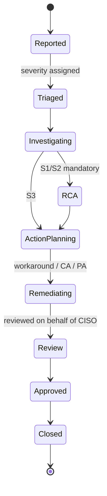

# 11 — Security Incident Module

Designed directly from the company's existing **Security Incident Template V2**, so the digital form matches what people already fill in today. The template also specifies the workflow (severity-driven reporting timeframes and mandatory actions), so it doubles as the workflow spec.

## Why it moved up a wave

Originally Wave 3. Moved to **Wave 2** because the template and workflow rules already exist (low design risk), and because a security incident is a **re-assessment trigger** for the risk module (per the RCI Risk Management Procedure) — the loop is incomplete without it.

## Form structure (maps to the template)

**General information:** OpCo*, Business Unit*, Report date*, Ticket number, Incident occurred date* / discovered date*, **Severity level***, Type of incident*, Incident status*, Close date.

**Incident details:** Title*, Description*, Damage/Impact*, Location*.

**Incident history:** chronological list of `date/time` + `description of event`.

**Root cause analysis** *(mandatory for S1, S2)*: root cause, responsible party, RCA complete date.

**Workaround:** action plan, execution date, action owner, status, remarks.

**Corrective action** *(mandatory for S1, S2)*: action plan, execution date, action owner, status, **corresponding CAR no.**, remarks.

**Preventive action** *(mandatory for S1, S2)*: action plan, execution date, action owner, status, remarks.

**Suggestions:** suggestion number, details, **related ISO 27001 clause**, whether the incident was caused by insufficient staff awareness.

**Other information** *(on request by RCL/CISO)*: violating acts, motives, disciplinary action, president view.

**Sign-off:** reviewed by … on behalf of CISO on `date`; approved by … on `date`.

> `*` = required field. Enforce required-ness in the form; keep the "other information" block permission-gated (see §5).

## Severity levels & reporting SLAs (drive the workflow)

| Level | Definition (abridged) | Initial reporting | Update cadence | RCA / CA / PA |
|---|---|---|---|---|
| **S1** | Impacts company or customer **sensitive** information; impacts systems/networks/users in other OpCos | **Immediately** | Twice a day | **Mandatory** |
| **S2** | Impacts company or customer **non-sensitive** information; impacts non-critical local/customer systems, access-layer networks | **Immediately** | Once a day | **Mandatory** |
| **S3** | No impact on company/customer information; non-critical local system without business interruption | Next day | Every 2 days | Optional |

These are **SLA timers in the workflow engine**, not just text: escalate on breach, and drive the update-reminder cadence automatically.

## Lifecycle



## Notifications & routing

- On submission: notify the OpCo security contact and, for **S1/S2**, the CISO line immediately.
- Update reminders fire on the severity cadence until closure.
- SLA breach → escalation to the next level.
- Notification recipients are **configurable per entity** (each OpCo has its own contacts) — do not hard-code.

## Data model

Extends the `Event` entity reserved in Wave 1.

| Field / relation | Notes |
|---|---|
| Base fields | Per `02a §1.1`, including `org_entity_id` (the OpCo) |
| `business_unit`, `ticket_number` | From the template |
| `occurred_at`, `discovered_at`, `reported_at`, `closed_at` | Distinguish occurred vs discovered — the template does |
| `severity` (S1/S2/S3), `incident_type`, `status` | Drive workflow and SLA |
| `damage_impact`, `location` | Free text |
| `IncidentHistoryEntry` (1:N) | Chronological event log (distinct from the system audit trail) |
| `RootCauseAnalysis` (1:1) | Root cause, responsible party, completion date |
| → `Action` (1:N) | Reuses the Wave 1 `Action` entity, typed as workaround / corrective / preventive; carries `car_no` |
| → `Issue` | An incident may raise issues (Wave 1 relationship) |
| → `Risk` | **Triggers risk re-assessment** — links back to affected risks/assets |
| `iso_clause_refs` | Link to ISO 27001 clauses (feeds SoA/control review) |
| `awareness_related` (bool) | Feeds security-awareness training decisions |
| Restricted block | Violating acts, motives, disciplinary action, president view |

## Access control (important)

The **"other information"** block (violating acts, motives, disciplinary action, president view) contains employee-conduct and potentially personal data. It must be **permission-gated to the CISO/HR roles**, hidden from ordinary incident handlers, and its access itself audited. Treat it as sensitive personal data for privacy purposes — this is exactly the kind of field where the platform must model the discipline it enforces.

## Loop back into GRC

```
Incident closed → risk re-assessment triggered (annual / post-incident / major change)
              → control effectiveness reviewed (ISO clause refs)
              → issues + corrective/preventive actions tracked to closure
              → posture dashboard updates
```
